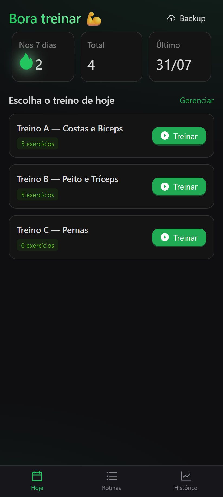
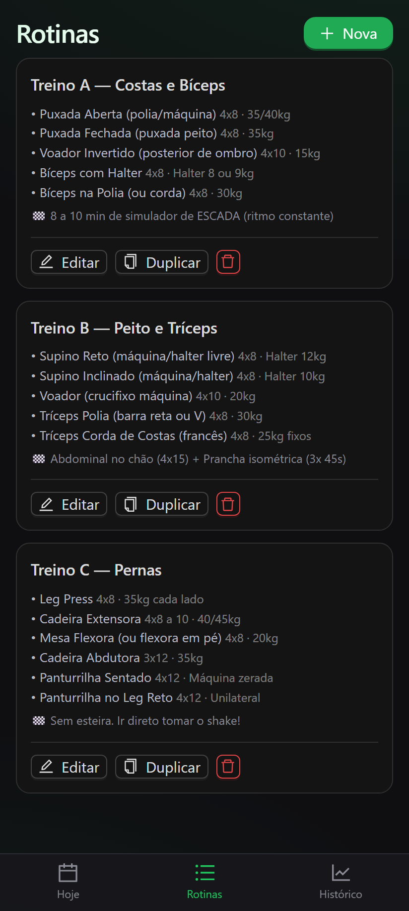
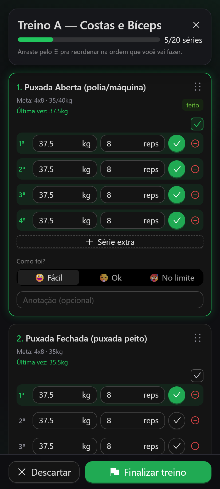
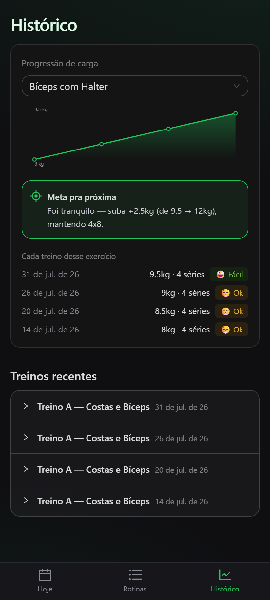

# 🏋️ Treino

App pessoal pra acompanhar treino de musculação — criar suas rotinas, registrar **peso e repetições reais** de cada série, e ver a **progressão de carga** com sugestão de meta pra próxima vez.

Feito pra substituir aquela gambiarra de mandar a rotina no WhatsApp e ir apagando o que já fez. 😅

- 📱 Funciona **offline**, direto no celular
- 🔒 **100% privado**: seus dados ficam só no seu aparelho (nada vai pra internet)
- 🎯 Sugere quando **subir a carga** com base em como foi o treino

---

## 📸 Telas

| Hoje | Rotinas | Treino | Histórico |
|:---:|:---:|:---:|:---:|
|  |  |  |  |

---

## 📥 Instalar no Android (APK)

1. Abra a página de **[Releases](../../releases/latest)** deste repositório
2. Baixe o arquivo **`treino.apk`**
3. Abra o arquivo no celular e toque em **Instalar**
   - Se pedir, ative **"instalar apps de fontes desconhecidas"** pro seu navegador/gerenciador de arquivos
4. Pronto — vai aparecer o app **Treino** na sua tela inicial 🎉

> É um app independente: depois de instalado, funciona **sem internet** e os dados ficam salvos no aparelho.

---

## 🚀 Como usar

1. **Crie suas rotinas** na aba **Rotinas** (ex: Treino A, B, C), com exercícios, séries, repetições e uma "meta" de referência de carga.
   - Dica: dá pra **duplicar** uma rotina pra montar variações rápido.
2. Na aba **Hoje**, toque em **Treinar** no treino do dia.
3. Durante o treino:
   - Ajuste o **peso** e as **reps** de cada série e marque com ✓ conforme for fazendo (ou marque todas de uma vez).
   - Diz **como foi** (😀 Fácil / 😮‍💨 Ok / 🥵 No limite).
   - Chegou e a máquina tá ocupada? **Arraste os exercícios** (pelo ⠿) pra fazer em outra ordem — a ordem fica registrada.
4. **Finalize** e o app mostra a **meta sugerida** pra próxima vez.
5. Na aba **Histórico**, veja o **gráfico de progressão** de cada exercício.

💾 **Backup:** na aba Hoje tem o botão *Backup* pra exportar/importar seus dados (útil ao trocar de celular, já que fica tudo local).

---

## 🛠️ Rodar / desenvolver localmente

Precisa do [Node.js](https://nodejs.org) 20+.

```bash
npm install
npm run dev
# abre em http://localhost:3000
```

Para gerar a versão web estática (usada pra empacotar o APK):

```bash
npm run build   # gera a pasta out/
```

---

## 📦 Gerar o APK

O APK é compilado **na nuvem** pelo GitHub Actions — não precisa instalar Android Studio.

- A cada `push` na branch principal, o workflow **[Build APK](../../actions)** roda, gera o `treino.apk` e publica em **[Releases](../../releases/latest)**.
- Também dá pra disparar manualmente em **Actions → Build APK → Run workflow**.

Quer compilar local? Precisa de JDK 21 + Android SDK, e então:

```bash
npm run build
npx cap sync android
cd android && ./gradlew assembleDebug
# APK em android/app/build/outputs/apk/debug/app-debug.apk
```

---

## 🧱 Stack

- [Next.js](https://nextjs.org) 16 (App Router, export estático) + React 19
- [Ant Design](https://ant.design) 6 (tema escuro) + SCSS
- [dnd-kit](https://dndkit.com) (arrastar pra reordenar)
- [Capacitor](https://capacitorjs.com) (empacota como app Android)
- Dados em `localStorage` (sem backend)

---

Feito pra uso pessoal, mas fica à vontade pra usar e adaptar. 💪
